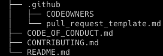

# Dotfiles - Recommended documentation/files to improve contribution for your tech company

Inspired by best practices, culture of documentation and [cgx](https://github.com/jeroenouw/cgx)

- [CODEOWNERS](https://docs.github.com/en/repositories/managing-your-repositorys-settings-and-features/customizing-your-repository/about-code-owners)
- [READMES](https://docs.github.com/en/repositories/managing-your-repositorys-settings-and-features/customizing-your-repository/about-readmes)
- [PULL_REQUEST_TEMPLATE](https://docs.github.com/en/communities/using-templates-to-encourage-useful-issues-and-pull-requests/about-issue-and-pull-request-templates#pull-request-templates)
- [CONTRIBUTING](https://docs.github.com/en/communities/setting-up-your-project-for-healthy-contributions/setting-guidelines-for-repository-contributors)
- [CODE OF CONDUCT](https://docs.github.com/en/communities/setting-up-your-project-for-healthy-contributions/adding-a-code-of-conduct-to-your-project)

## Light reading
- [Why you should add GIFs in your PRs](https://dev.to/opensauced/how-to-create-a-good-pull-request-template-and-why-you-should-add-gifs-4i0l)
- [Diagramming as code](https://diagrams.mingrammer.com/)
